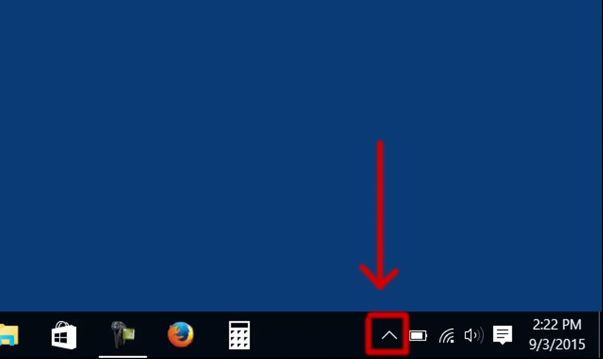

# use vmess on windows (v2ray core)

#### install v2ray core
1. download [v2ray core](../client/windows/v2rayN-Core.zip)
2. extract file and duble click on ```v2rayN.exe```
3. now from windows bar open on ^ icon and open application



<br>

4. keep calm if it is chinese use following steps to make it english

close applicatin 

close it from bottom icon too


5. reopen ```v2rayN.exe```


#### connect v2ray server

1. click on servers and open 

2. fill the inputs
3. you must change ```system proxy``` to ```set system proxy``` and ```routing``` to ```global```


